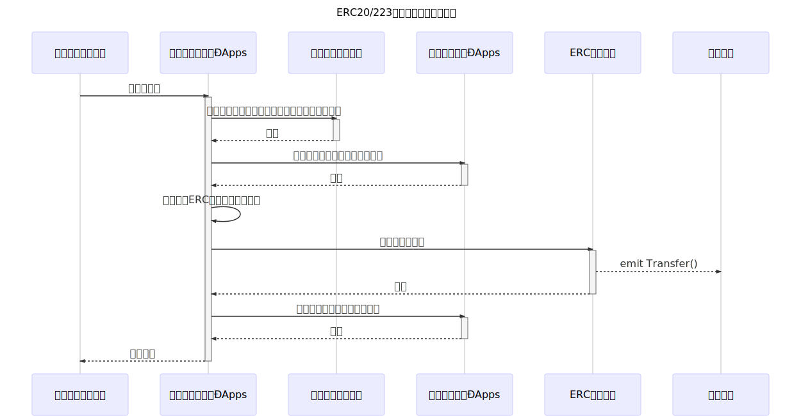

# Implementation for exchanging from Internal Distribution Token to ERC20/223 Token

*Read this in other languages: [English](README.en.md), [日本語](README.ja.md).*

It is under development.

このリポジトリのソースコードは、現在開発段階のものです。

## 概要

これは、『内部流通トークン』のユーザーがオーナーへ内部流通トークンからERC20/223のトークンへの交換の際の Exchange イベントをトリガーとして指定の ERC20/223トークンを送金するÐAppsの実装です。

- 内部流通トークン - [godappslab/internal\-distribution\-token: Implementation of Internal Distribution Token](https://github.com/godappslab/internal-distribution-token)

イベントを受け取る部分、および、イベント内の情報をもとに "TokenTransfer" ÐAppsを実行する部分は Web3.js を使用したウェブモジュールによって実行します。

## 要点

内部流通トークンを完全で確実にERC20/223トークンへ交換する仕組みを提供します。

## このÐAppsによって実現できること

- 確実な支払いを行うことができる
- 支払いが行われたことを、その記録が改ざんされること無く確認することができる
- 動作のトリガーとなるのは内部流通トークンが発するイベントであるため、無人運転が可能

## 仕様

**TransferHistoryのインターフェース**

*TransferHistory* は記録を実行する *TokenTransfer* ÐAppsのスマートコントラクトのアドレスを管理する。決められているアドレス以外からの、履歴記録は応じない。

アドレスの登録はオーナーが `updateTransferDappsAddress()` 関数を実行することにより設定できる。

```solidity
pragma solidity ^0.5.0;

interface TransferHistoryInterface {
    function isTokenTransferred(bytes calldata _signature) external view returns (bool);
    function recordAsTokenTransferred(bytes calldata _signature) external returns (bool);
    function updateTransferDappsAddress(address _newTransferDapps) external returns (bool);
}
```

**ERC20/223トークン支払いの処理**

Sequence Diagram



flowchart



## Test Cases

[Truffle Suite ](https://truffleframework.com/) を利用したテストスクリプトで動作確認を行う。

```bash
$ truffle test
Using network 'test'.

Compiling ./contracts/token-transfer/TokenTransfer.sol...
Compiling ./test/DummyERCToken.sol...
Compiling ./test/DummyInternalCirculationToken.sol...
ownerAddress: 0x627306090abaB3A6e1400e9345bC60c78a8BEf57


  Contract: [TEST] TokenTransfer
       [LOG] erc_token: 0x8f0483125FCb9aaAEFA9209D8E9d7b9C8B9Fb90F
       [LOG] point_token: 0x9FBDa871d559710256a2502A2517b794B482Db40
       [LOG] transfer_history: 0x2C2B9C9a4a25e24B174f26114e8926a9f2128FE4
       [LOG] tokenTransfer: 0x30753E4A8aad7F8597332E813735Def5dD395028
    ✓ Deploying Smart Contract (288ms)
       [LOG] Returned error: VM Exception while processing transaction: revert Mismatch with address obtained from signature -- Reason given: Mismatch with address obtained from signature.
    ✓ [Different nonces] Mismatch with address obtained from signature (177ms)
       [LOG] Returned error: VM Exception while processing transaction: revert Mismatch with address obtained from signature -- Reason given: Mismatch with address obtained from signature.
    ✓ [Different token quantity] Mismatch with address obtained from signature (136ms)
       [LOG] Returned error: VM Exception while processing transaction: revert Mismatch with address obtained from signature -- Reason given: Mismatch with address obtained from signature.
    ✓ [Different address] Mismatch with address obtained from signature (120ms)
       [LOG] Returned error: VM Exception while processing transaction: revert transfer failed -- Reason given: transfer failed.
    ✓ ERC token transfer failure (151ms)
    ✓ [The first time] Success (129ms)
       [LOG] Returned error: VM Exception while processing transaction: revert Already token remitted -- Reason given: Already token remitted.
    ✓ [Second time fail] Already token remitted (129ms)


  7 passing (1s)
```

## 実装

このÐAppsの実装はGitHubにて公開する。

https://github.com/godappslab/token-transfer
